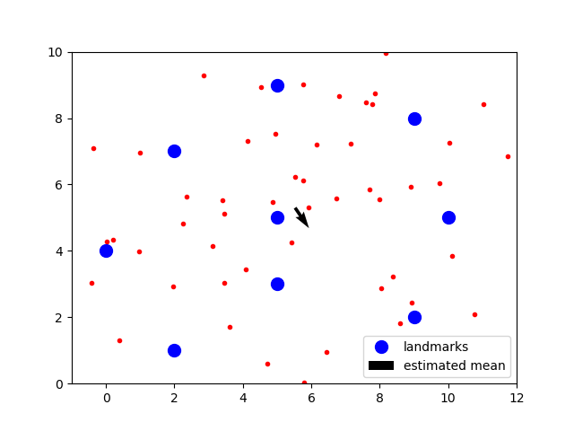

# Localization Using Particle Filter

We will implement a particle filter to localize a robot moving on a 2D map with several landmarks.

We use the Odometry motion model to estimate the robot movement. 

The measurement is obtained from a range-finder sensor, and it reports the distances to the landmarks. 

The world map and sensor data can be obtained from the data folder. 

By running the 'particle_filter.py', the results are visualized as follows. The red dots represents the particles, and mean of particles' estimate is shown using the black arrow. 

